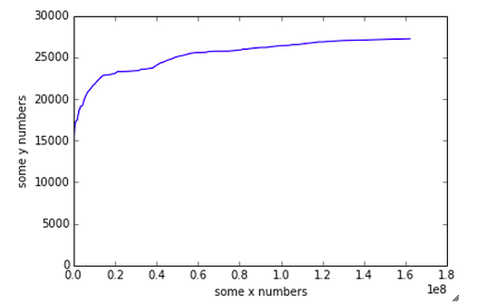
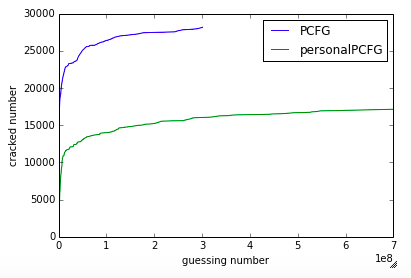
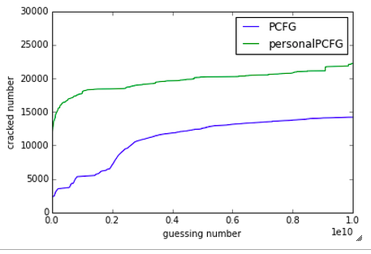
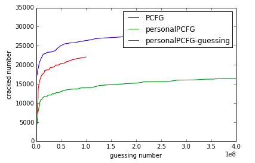

====##12306 Paper
###Preliminary Results:
#### 1. Structure of the passowrds:
The following table shows the most frequent 20 password structures, in which "D" represents digits, "L" represents letters, and "S" represent special characters. The number following the letters indicate the length of the segment. For example, password132 -> L7D3

|Structure | frequency| percentage|
|------:|:------:|:----|
|D7|10906|8.283%|
|D8|9458|7.184%|
|D6|9102|6.913%|
|L2D7|5073|3.853%|
|L3D6|4832|3.670%|
|L1D7|4778|3.629%|
|L2D6|4275|3.247%|
|L3D7|3885|2.950%|
|D9|3594|2.729%|
|L2D8|3371|2.560%|
|L4D4|3105|2.358%|
|L1D8|3103|2.356%|
|L6D3|2798|2.125%|
|L6D4|2476|1.880%|
|L7D3|2192|1.664%|
|L5D3|2158|1.639%|
|L5D4|2125|1.614%|
|L8|2079|1.579%|
|D7L1|1973|1.498%|
|L3D4|1879|1.427%|

The result is a little different from previous workds due to:
* No complicated password constraint is set.
* The nature of this website is different from others.

####2. Most frequently used passwords

NOTE:this is very different from previous research. The congregation is regarded much higher than this in Chinese Password set.

|PASSWORD|PERCENTAGE|
|-------:|:-------|
|123456|0.297%|
|a123456|0.213%|
|123456a|0.125%|
|5201314|0.122%|
|111111|0.119%|
|woaini1314|0.103%|
|123123|0.074%|
|qq123456|0.074%|
|000000|0.073%|
|1qaz2wsx|0.070%|
|1q2w3e4r|0.063%|
|qwe123|0.060%|
|7758521|0.057%|
|123qwe|0.051%|
|a123123|0.047%|
|woaini520|0.042%|
|123456aa|0.041%|
|1314520|0.039%|
|100200|0.039%|
|woaini|0.038%|

####3. Longest Common Sequence
Here we compute the coverage of longest common sequence, which is computed as $len(LCS) \over len(password)$

The results are shown below:

|Info | longest common sequence|longest common consecutive sequence|
|-------:|:-------:|:--------|
|Birthday |0.33 | 0.23|
|Name|0.17| 0.13|
|Email|0.32| 0.21|
|Tel|0.31| 0.16|
|Account|0.32| 0.24|
|ID Number|0.44| 0.27|
Considered that the average length of the password is 8.43. The rate does not seem much. However, the structure of passwords are usually combined with letters, symbols, and digits. The rate is underested.

Let's see the same rate for D7, D8, and D6, which are most commonly used structures (account for over 20% of all passwords)

for __D7__

|Info | longest common sequence|longest common consecutive sequence|
|-------:|:-------:|:--------|
| Birthday |0.376|0.226|
|Name|0.0|0.0|
|Email|0.326|0.207|
|Tel|0.425|0.215|
|Account|0.294|0.250|
|ID Number|0.572|0.277|

for __D8__

|Info | longest common sequence|longest common consecutive sequence|
|-------:|:-------:|:--------|
| Birthday |0.543|0.430|
|Name|0.0|0.0|
|Email|0.312|0.205|
|Tel|0.432|0.195|
|Account|0.238|0.194|
|ID Number|0.669|0.461|

for __D6__

|Info | longest common sequence|longest common consecutive sequence|
|-------:|:-------:|:--------|
| Birthday |0.532|0.390|
|Name|0.0|0.0|
|Email|0.319|0.220|
|Tel|0.462|0.236|
|Account|0.245|0.210|
|ID Number|0.695|0.445|

Now let's set a threshold of coverage to be 0.7 (most of the digits in password are covered) and compare the password to birthday.

|Dataset| longest common sequence|longest common consecutive sequence|
|-------:|:-------:|:--------|
| D7 |0.076|0.048|
| D8 |0.214|0.192|
| D6 |0.303|0.289|

#### 4.Coverage
==TODO: IMPROVE COVERAGE==
Coverage will be an important factor for measuring the correlation of the passwords and personal informaiton. Coverage is defined as the ratio of the password that can be recovered from the personal information. In short, $cvg = {len(LCS) \over len(password)}$. Firstly we segmentize the passwords into "Letter", "Digits", and "Special Symbols". Then we try to map "Letter" and "Digits" with personal information (Map Letter with name, email, and account, map digits with birthday, email, cellphone, id number, and account). We map these segments by the following rules:
1. We find the longest common sequence (LCS) between each segment of password and each type of personal information that is used to mapping.
2. We select the longest common sequence as the candidate for each segment of password.
3. As a result we found a (and only one which is the longest) subset for each segment of the password, and we calculate how much the subsets can cover the entire password. 

Longest common sequence may not accurately indicate that the 2 sequences have certain relation. There might be coicidence that 2 irrelavent strings have some common sequence, say "12345678" and "19920303" have LCS "123", we introduce a threshold $\sigma$ to reduce the probability of such coincidences. That is to say, when the $len(Seg) \times \sigma >= len(LCS)$, the coverages counts, otherwise the coverage will be reset to 0 for this segment. The example above will then result in 0 coverage when $\sigma$ is chosen as 0.5 (len(LCS) needs to be at least 0)

We then calculate the coverage for different threshold.

|threshold| Coverage|threshold|Coverage|
|-------:|:--------:|:------:|:-------|
|0  | 0.717 |0.6| 0.556 |
|0.1| 0.717 |0.7| 0.475 |
|0.2| 0.715 |0.8| 0.419 |
|0.3| 0.708 |0.9| 0.374 |
|0.4| 0.691 |1  | 0.374 |
|0.5| 0.662 |

Note that ID number contains exactly the birthday in our dataset, and it contains too many digits which may have negative impact on our measurement, so we remove it and the result is:

|threshold| Coverage|threshold|Coverage|
|-------:|:--------:|:------:|:-------|
|0  | 0.667 |0.6| 0.467 |
|0.1| 0.667 |0.7| 0.402 |
|0.2| 0.665 |0.8| 0.372 |
|0.3| 0.651 |0.9| 0.350 |
|0.4| 0.621 | 1 | 0.350 |
|0.5| 0.572 |

We can have the following observation:
1. Personal information has large correlation with password
2. Threshold $\sigma$ does reduce the probability of coincidence
3. Even with $\sigma = 1$, which means each segment in the password can be fully recovered from personal information, A significant number of password can be recovered. 

#### 5.New representation of password
Although coverage may be a good indicator of how passwords are correlated to personal information, we still do not know how the passwords are constructed from personal information and which type of information are mostly used. 

Therefore we create a new representation of password, which is useful in measurement and password cracking. This new representation is evolved from the original PCFG. We call it personal representation. Like original PCFG, personal representation consists of different "TYPES" of segments. An example is $[name_4][bd_8]$ or $[name-initial_2][cellphone_{11}]$

==~~TODO:Key stroke strings can be added~~==

####6. Personal Information Matching
We use a greedy algorithm to match the password with personal information. It involves multiple steps:
1. Find all the substrings of the password.
2. Sort the substrings by its length in descending order
3. From the longest length, try to match the personal information to the substrings. 
4. If a match is found, recursively found the segments left. 
5. Only segment with length >= 2 will be matched.

For example, a string Chris19880808abc will be matched in the following order:

1. Find all the substring of Chris19880808abc
2. Try from Chris19880808abc, Chris19880808ab, and hris19880808ab to 19880808
3. A birthday is matched, substitute 19880808 with [BD], the password becomes Chris[BD]abc
4. Match Chris and abc separately with personal information again
5. A name is matched, the password becomes [NAME][BD]abc
6. abc is not matched to anything, it will then be represented using a PCFG convention
7. The password will finally be [NAME][BD]L3

####7. Matching rules 
By matching we mean the password substring is very related to a kind of personal information. Different kind of personal information is handled differently. 

* __Birthday__

Birthday is most likely to be digits only. We use multiple permutations of year, month, and day to represent birthday. If any permutation is exactly the same as the input string, a match is found. Note that we apply restrictions on the length of the substring to be matched because we want to avoid coincidence to make the result more accurate. 
These permutations are:
YYYY+MM+DD, YYYY+M+DD, YYYY+M+D, YY+MM+DD, YY+M+DD, YY+M+D, YYYY+MM, YYYY+DD, YYYY, YY, MM+DD, M+DD, M+D

* __Name__

The name in our database is in Chinese, we convert it into Pinyin. A name is matched if the Pinyin or the Pinyin initials is exactly the same as the input string. For example, liyue or ly will be matched to [NAME].

* __Email__

Email is usually of the form A@B.C. If the input string is a substring of A, B or C, then a email match is found. Note that A will be personal information, B and C are more related to the service name. 

* __Cellphome__

If the input string is at least of length 4, and is a substring of the cellphone. A cellphone match is found.

* __Account__

If the input string is at least of length 4, and is a substring of the account name. An account match is found.

* __ID__

If the input string is at least of length 4, and is a substring of the ID. An ID match is found.

####8. Matching Result
The following table is the matching result from the whole database. 

|FORM|FREQUENCY|percentage|
|------:|:------:|:------|
|D7|7182|5.46%|
|[ACCT]|6915|5.26%|
|[BD]|5965|4.53%|
|D6|4930|3.75%|
|[NAME][BD]|4343|3.30%|
|D8|4272|3.25%|
|L1D7|3310|2.51%|
|[EMAIL]|3070|2.33%|
|[NAME]D7|2213|1.68%|
|L2D7|1966|1.49%|
|[NAME]|1859|1.41%|
|D9|1841|1.40%|
|[NAME]D3|1769|1.34%|
|[NAME]D6|1684|1.28%|
|L1D8|1655|1.25%|
|L6D3|1513|1.15%|
|L2D6|1482|1.12%|
|D7L1|1440|1.09%|
|L3D6|1356|1.03%|
|L1D6|1342|1.02%|

We may have the following observations:
1. There is a significant number of password which is associated with personal information. 
2. The most popular information is the [ACCT], [BD], and [NAME]
3. A number of passwords can be fully recovered from personal information while some other passwords have segments not associated to personal information, which needs some guesssing. 

#### 9. Password usage in different groups of users
We try to study the difference between males and females. And people from different age group 

* Male and Female:

Our database is biased in gender. We have 9,856 females and 121,533 males. Although the number is not balanced, we can still get some insight on how male and female choose their passwords. 
The matching result for __male__ is 

==~~TODO: Match the number of male and female~~==

|FORM|FREQUENCY|percentage|
|------:|:------:|:------|
|D7|6756|5.55%|
|[ACCT]|6486|5.33%|
|[BD]|5694|4.68%|
|D6|4444|3.65%|
|[NAME][BD]|4135|3.40%|
|D8|3946|3.24%|
|L1D7|3142|2.58%|
|[EMAIL]|2876|2.36%|
|[NAME]D7|2165|1.78%|
|[NAME]|1797|1.47%|
|L2D7|1793|1.47%|
|D9|1747|1.43%|
|[NAME]D3|1712|1.40%|
|[NAME]D6|1635|1.34%|

We randomly select 9800+ users from male lists and compare with female list. Female is on the __left__ and male is on the __right__:

|RANK|FORM|FREQUENCY|PERCENTAGE|FORM|FREQUENCY|PERCENTAGE|
|-----:|:------:|:------:|:------:|:-----:|:-----:|:-------|
|1|D6|486|4.93%|[ACCT]|510|5.17%|
|2|[ACCT]|429|4.35%|D7|503|5.10%|
|3|D7|426|4.32%|[BD]|467|4.73%|
|4|D8|326|3.30%|D6|364|3.69%|
|5|[BD]|271|2.74%|D8|319|3.23%|
|6|[NAME][BD]|208|2.11%|[NAME][BD]|317|3.21%|
|7|L2D6|204|2.06%|L1D7|288|2.92%|
|8|[EMAIL]|194|1.96%|[EMAIL]|237|2.40%|
|9|L2D7|173|1.75%|[NAME]D7|187|1.89%|
|10|L3D6|171|1.73%|[NAME]|154|1.56%|
|11|L1D7|168|1.70%|[NAME]D3|153|1.55%|
|12|L6D3|165|1.67%|L2D7|144|1.46%|
|13|L3D7|141|1.43%|D9|138|1.40%|
|14|L4D4|139|1.41%|[NAME]D6|134|1.35%|
|15|L6D4|124|1.25%|L1D8|117|1.18%|

* Age group
==~~TODO: Try under 18 and over 65, or 10 years gap (NOT THAT FEASIBLE, Over 72% of the users are in 20-30 range, only 208 users are younger than 18 and only 150 users are older than 65. But still we can try <25, 25-30, and >25~~==

We divide the data into 3 groups -- younger than 25, 25-30, and over 30. The corresponding number of users are 35465, 70002, and 25922. The result is shown in the following table:

|RANK|FORM(Y)|PERCENTAGE|FORM(A)|PERCENTAGE|FORM(O)|PERCENTAGE|
|-----:|:------:|:------:|:------:|:-----:|:-----:|:-------|
|1|[ACCT]|6.94%|D7|6.05%|D6|6.25%
|2|D7|4.72%|[BD]|5.24%|[BD]|5.27%
|3|L1D7|4.10%|[ACCT]|5.16%|D7|4.88%
|4|[NAME][BD]|3.22%|D6|3.72%|D8|3.90%
|5|[EMAIL]|2.95%|D8|3.50%|[ACCT]|3.21%
|6|[BD]|2.60%|[NAME][BD]|3.47%|[NAME][BD]|2.95%
|7|L2D7|2.28%|[EMAIL]|2.28%|[EMAIL]|1.63%
|8|D8|2.27%|L1D7|2.17%|L2D6|1.61%
|9|D6|1.97%|[NAME]D7|1.76%|L3D6|1.46%
|10|[NAME]D7|1.97%|D9|1.63%|[NAME]D6|1.43%
|11|L1D8|1.82%|[NAME]|1.61%|L4D4|1.28%
|12|[NAME]D3|1.73%|[NAME]D3|1.30%|L1D7|1.28%
|13|L3D7|1.50%|[NAME]D6|1.29%|L8|1.23%
|14|D9|1.39%|L2D7|1.25%|L6|1.19%
|15|L6D3|1.38%|L1D8|1.14%|[NAME]D7|1.06%

==TOOD: consider service information, like ranking of the pinyin==
==TODO: Password Protection -- Distortion Function==

#### 10 Pinyin ranking -- Service Information
We wish to explore whether the Service Information help in cracking the password. 
Initial study
1. How many "piao" are in passwords?
We used a list of keywords related to "piao" to explore how many passwords carry the service information. 

The list is [chepiao,maipiao,goupiao,huoche,train,railway,ticket]
The keywords appear 0 time in 131389 passwords. 

However, we found that service information is more likely to be in the username. There are 105 out of 131389 username contains at least one word from the keyword list, which is 0.08%.

__Our observation is that Service Information does not happen in Passowrd much, but it does show in account name__

A whole Pinyin table is extracted from [Wikipedia Pinyin Table](http://en.wikipedia.org/wiki/Pinyin_table). We again use the recursive matching algorithm to find most commonly used Pinyin in passwords. They are shown in the below table. We can see that short pharse and last names are overwhelming. 

==TODO: COMPARE WITH OTHER DATASET -- As many as we can==

|PINYIN|OCCURANCE|PERCENTAGE|
|---:|:---:|:----|
|a|17155|18.2%
|o|3943|4.20%
|e|3720|3.96%
|wo|2242|2.39%
|li|1994|2.12%
|ai|1844|1.96%
|ni|1543|1.64%
|wang|1381|1.47%
|lo|1149|1.22%
|yu|1127|1.20%
|wei|1079|1.15%
|xiao|1061|1.13%
|ma|1030|1.09%
|liu|916|0.97%
|yang|900|0.95%
|shi|873|0.93%
|zhang|827|0.88%

Then we wish to get the parts in password which are not recognized as personal information and do similar processing. The most commonly used Pinyin words are:

|PINYIN|OCCURANCE|PERCENTAGE|PINYIN|OCCURANCE|PERCENTAGE|PINYIN|OCCURANCE|PERCENTAGE|
|---:|:---:|:----:|:---:|:---:|:---:|:---:|:---:|:---|
|a|6240|10.2%|a|9513|23.2%|a|14270|21.7%
|q|1409|2.30%|aa|892|2.18%|o|3178|4.85%
|z|1026|1.67%|e|827|2.02%|e|2991|4.56%
|w|889|1.45%|o|729|1.78%|wo|2122|3.23%
|aa|810|1.32%|woaini|551|1.34%|ai|1722|2.62%
|asd|598|0.97%|li|493|1.20%|ni|1409|2.15%
|woaini|526|0.85%|loe|481|1.17%|li|1032|1.57%
|as|487|0.79%|er|404|0.98%|lo|1004|1.53%
|qq|486|0.79%|wang|324|0.79%|ma|845|1.28%
|qwe|472|0.77%|liu|304|0.74%|er|821|1.25%
|s|444|0.72%|zhang|271|0.66%|xiao|729|1.11%
|li|441|0.72%|aaa|263|0.64%|shi|679|1.03%
|x|385|0.62%|wa|258|0.63%|yu|601|0.91%
|abc|357|0.58%|wo|236|0.57%|wang|600|0.91%
|l|335|0.54%|yu|229|0.56%|le|541|0.82%
|love|309|0.50%|oo|194|0.47%|wei|504|0.76%
|wang|292|0.47%|chen|175|0.42%|da|494|0.75%
|liu|290|0.47%|ma|173|0.42%|liu|477|0.72%
|c|282|0.46%|ai|162|0.39%|de|442|0.67%
|qw|252|0.41%|woai|152|0.37%|zhang|420|0.64%

Again this is overwhelmed by woaini or last name.

#### 11. Other database -- service information
__Tianya__

67,312 out of 24,087,768 passwords (0.2%) contains string "tianya". However, 44227 passwords are "111222tianya". There might be noise in the dataset because it does not make sense that so many people choose the same password "111222tianya". if we take these duplications out, it turns out less than 0.1% user uses service information in their passwords

__Rockyou__

8,823 out of 28,688,782 passwords use string "rockyou" in their passwords (0.03%). Again, the percentage is so low that we can safely ignore it. 

__PHPBB__

1411 out of 184389 passwords contain string "phpbb" (0.8%)

__Myspace__

51 out of 37144 contain string "myspace" (0.1%)

#### 12. New coverage:
The coverage metric is improved. The new method uses a sliding window to compute the correlation between passwords and personal information. It works like the following:

1. Choose a window size (usually 1-4).
2. Slide the window from the begining of the password to the end.
3. With in a window, match the string in the window to personal information.
4. If a match is found, mark all character in the window as "match".
5. Window moves forward one character after all personal information have been tried for match.

==	TODO: Use PCFG to Crack the dataset	==

==	TODO: PASSWORD PROTECTION -- encrypt serviceinfo + personalinfo with private key(Password manager without password stored in it)  ==

Results:

|WINDOWSIZE|COVERAGE|
|:----:|:------:|
|1|0.926
|2|0.608
|3|0.389
|4|0.297
|5|0.229
|6|0.206
|7|0.147

####13.Most relevant personal information. 
As we have multiple types of personal information available, we rank them in the following table

|Info Type | Occurance | Rate|
|:---:|:---:|:----:|
|[BD]|30874|0.234|
|[NAME]|21161|0.161|
|[ACCT]|17069|0.129|
|[EMAIL]|5359|0.040|
|[ID]|2947|0.022|
|[CELL]|572|0.004|

#### 14. PCFG Cracking
__Use original PCFG to crack the passwords with half training and half testing__

Dictionary: __A perfect Dictionary__

#### 15. personalPCFG Cracking
==note: We need to delete the person entry from the testing set if his password is cracked out==
Result

